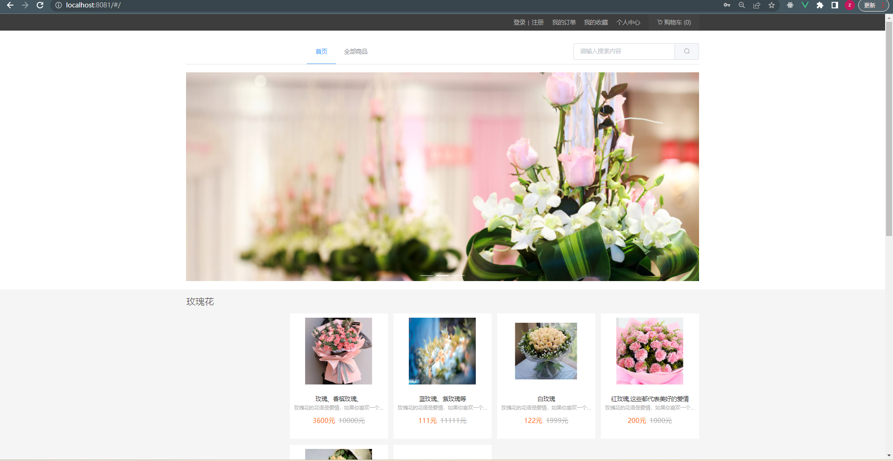
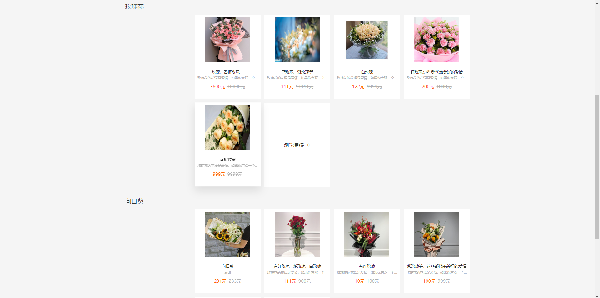
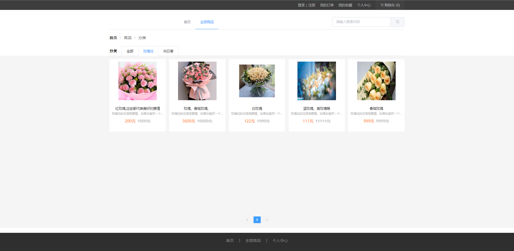
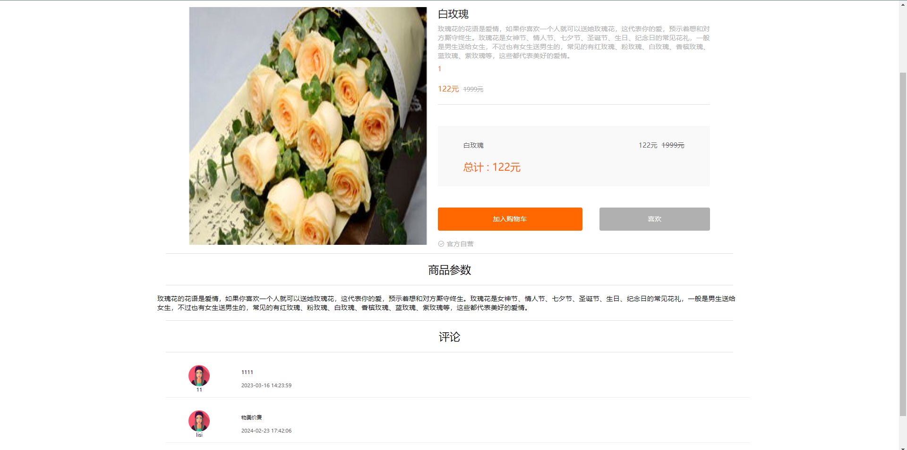
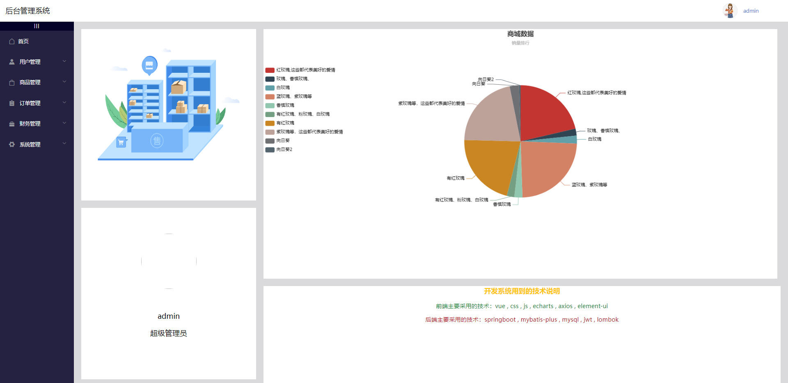
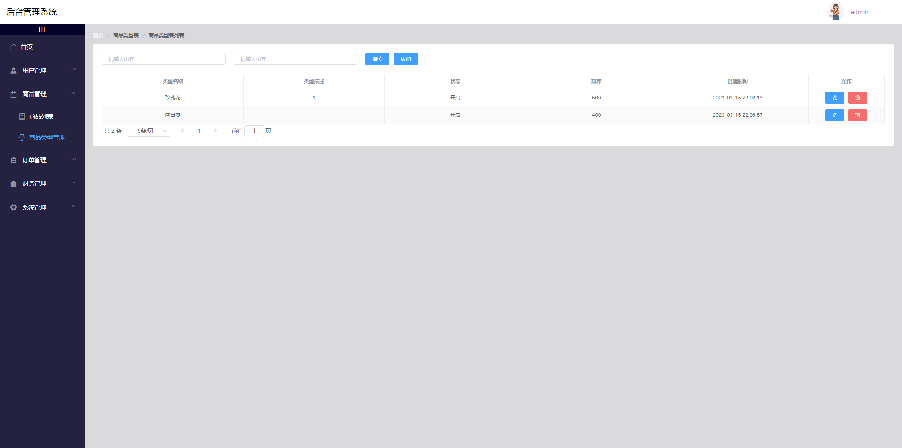
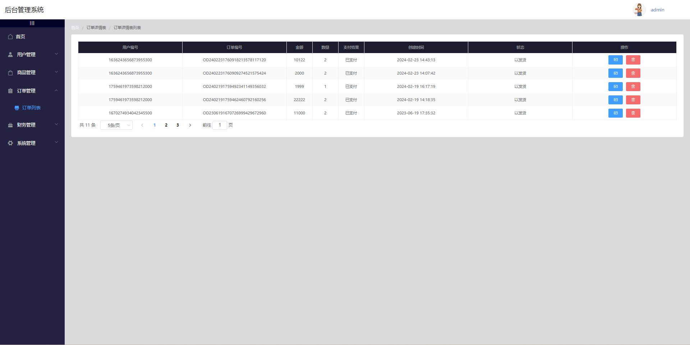

# 基于springboot+vue前后端分离的鲜花商城网站

### 9.9￥ 获取完整源码+sql，需要加Q：3808981644  或者加微信 ：qszard26
### 有问题，或者需要协助调试运行项目的也可联系
### 更多项目： https://github.com/34426?tab=repositories

## 一、项目介绍

开发语言：java

运行环境:idea或eclipse vscode 数据库:mysql

本系统功能包括:

后台（管理员也就是商家）:登录，首页，用户管理，商品管理，订单管理，财务管理，系统管理，充值管理，角色管理，个人中心

前台（用户）:注册，登录，首页，自商城区，登录，注册，我的订单，我的收藏，个人中心，购物车，评论

开发语言：java

运行环境:idea或eclipse vscode 数据库:mysql

前端主要采用的技术：vue ,css , js , echarts , axios , element-ui

后端主要采用的技术：springboot , mybatis-plus , mysql , jwt

## 二、部分功能界面展示

### 9.9￥ 获取完整源码+sql，需要加Q：3808981644  或者加微信 ：qszard26
### 有问题，或者需要协助调试运行项目的也可联系

